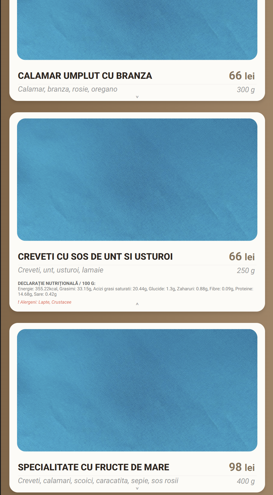

# 🍽️ Digital Menu | Taverna La Zavat

A premium, cloud-connected digital menu solution engineered for high performance, ease of use, and strict compliance with food safety regulations. Built with the latest web technologies: **Next.js** and **TiDB (Serverless MySQL)**.

## 🟢 Live
**Experience the live application here:** 🔗 **[[https://la-zavat-menu.vercel.app](https://la-zavat-menu.vercel.app)]**

---

## 📸 Interface Preview

| Mobile View (QR Scan) | Product Details |
|:--------------------------:|:---------------:|
|  |  |

---

## ✨ Project Highlights

This application transforms the traditional dining experience into a digital one, prioritizing transparency and speed.

### 🥗 Regulatory Compliance & Transparency
- **Nutritional Declarations:** Each product displays a complete breakdown of nutritional values (Energy, Fats, Saturated Fatty Acids, Carbohydrates, Sugars, Fiber, Proteins, Salt), complying with modern food safety laws.
- **⚠️ Allergen Alerts:** Allergens are clearly highlighted for every item, ensuring customer safety and informed decision-making.

### ⚡ High-Performance Architecture
- **Real-Time Cloud Data:** The menu is connected to a **TiDB Cloud Database**. Any change in price or availability propagates instantly to all customers without needing a site redeploy.
- **Instant Loading:** Built on Next.js, the application uses server-side rendering for lightning-fast page loads, even on mobile data connections.

### 📱 User Experience
- **QR Code Optimized:** Designed specifically for the "Scan & View" workflow.
- **Categorized Navigation:** Intuitive filtering for Food, Bar, and Wine selections.

---

## 🛡️ Architecture & Hybrid Workflow

This project implements a unique **Hybrid Security Architecture** to separate public access from administrative control.

### 1. The Public Interface (Vercel)
- **Role:** Customer View.
- **Access:** Global / Public.
- **Function:** Read-only access to the menu. Optimized for speed and reliability.

### 2. The Internal CMS (Localhost)
- **Role:** Management Dashboard.
- **Access:** Restricted (Local Environment Only).
- **Security:** Protected by custom Middleware and Environment Authentication.
- **Capabilities:**
  - **Drag & Drop Reordering:** Intuitive organization of categories and products using `dnd-kit`.
  - **Inventory Management:** Instant updates to prices, ingredients, and stock status.
  - **Secure Writes:** Only this environment has write-access to the Cloud Database.

---

## 🛠️ Tech Stack

- **Frontend Framework:** Next.js 14 (App Router)
- **Database:** TiDB Cloud (Serverless MySQL)
- **Styling:** CSS Modules / Custom Responsive Design
- **State Management:** React Hooks
- **Deployment:** Vercel Global CDN

---

Food pictures will be uploaded soon